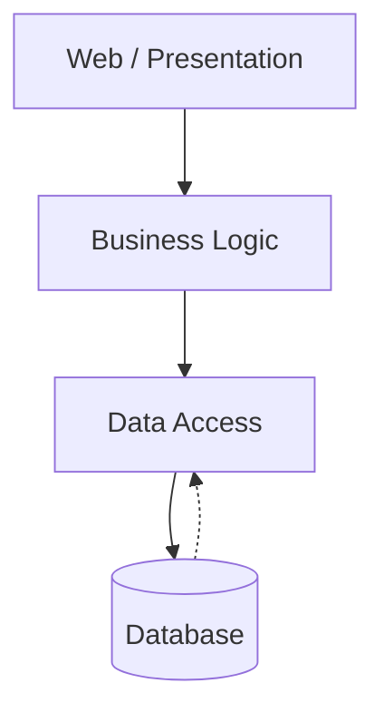
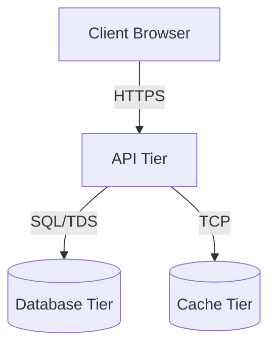
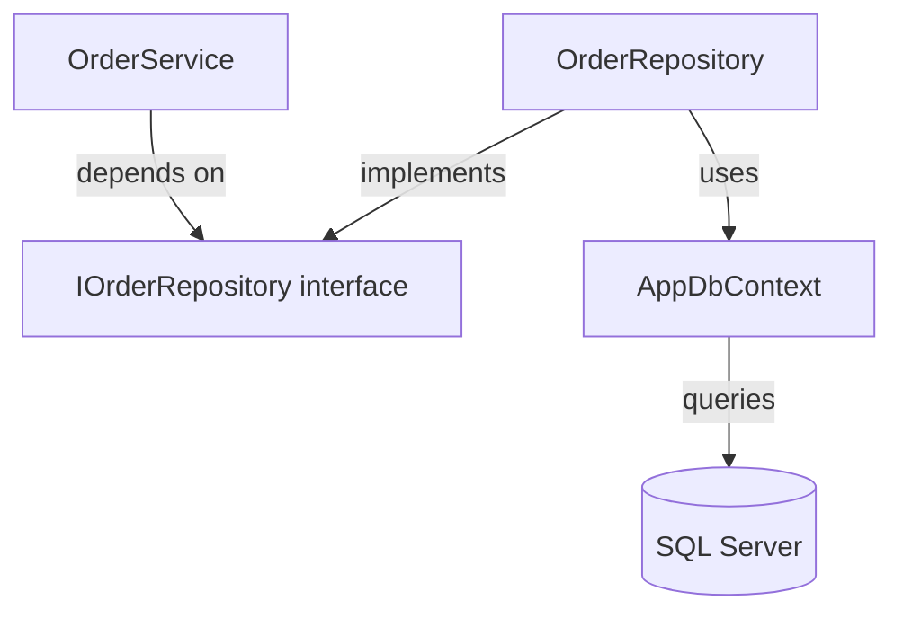
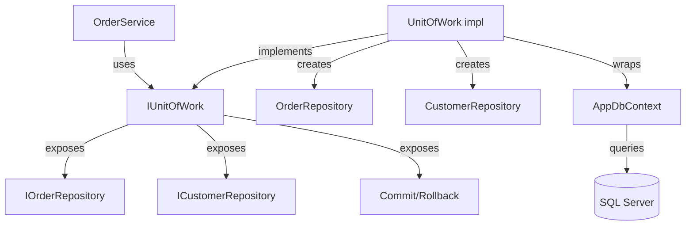
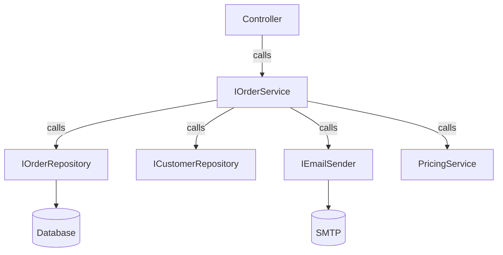
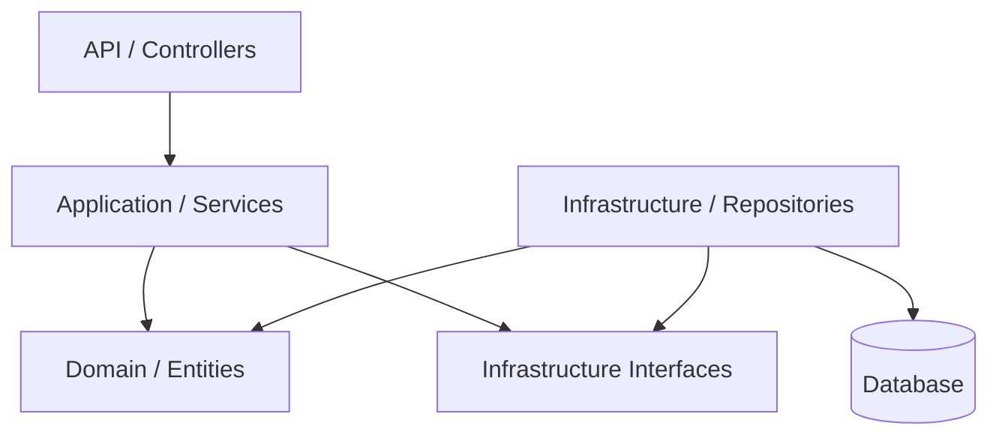
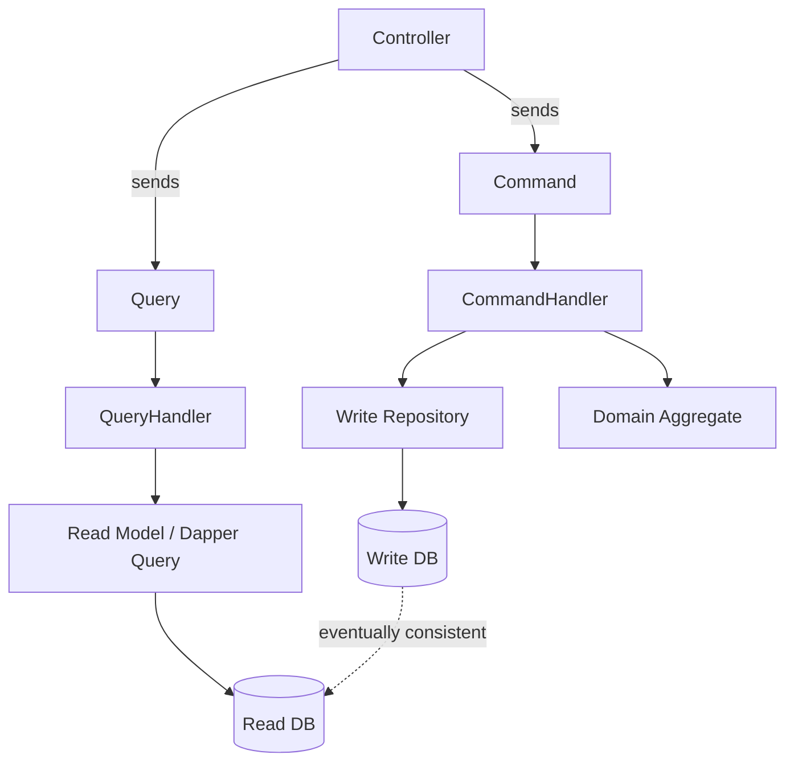
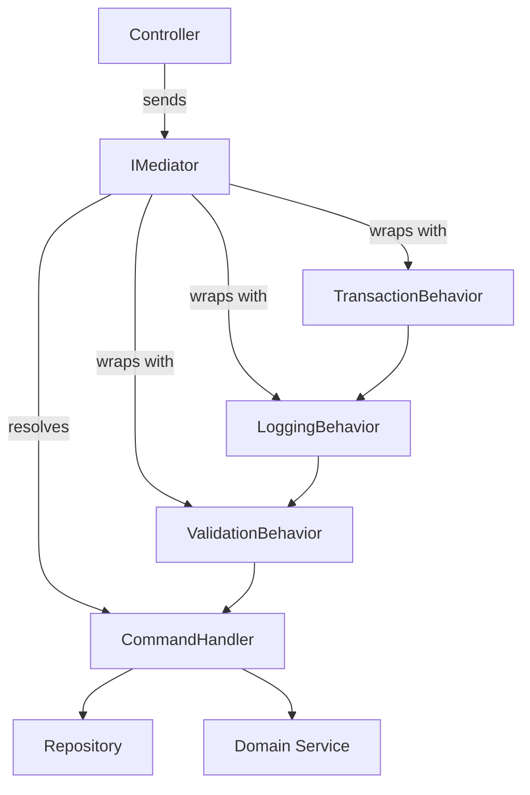

# The Complete Guide to .NET Project Architecture and Folder Organization

### From Small CRUD Applications to Enterprise Distributed Systems

> **A principal-level handbook for .NET developers — from beginner to architect.**
> This document is opinionated, practical, and grounded in real enterprise experience. Every architectural decision is explained not just by *what* it is, but by *why* it exists, *what problems it solves*, *when to use it*, *when to avoid it*, and *what trade-offs you accept* when you choose it.

---

## Table of Contents

1. [Introduction](#1-introduction)
2. [Why Software Architecture Matters](#2-why-software-architecture-matters)
3. [What Makes a Good Architecture?](#3-what-makes-a-good-architecture)
4. [Understanding Coupling & Cohesion](#4-understanding-coupling--cohesion)
5. [Separation of Concerns](#5-separation-of-concerns)
6. [SOLID Principles](#6-solid-principles)
7. [Dependency Injection](#7-dependency-injection)
8. [Layered Architecture](#8-layered-architecture)
9. [N-Tier Architecture](#9-n-tier-architecture)
10. [Repository Pattern](#10-repository-pattern)
11. [Generic Repository](#11-generic-repository)
12. [Repository + Unit of Work](#12-repository--unit-of-work)
13. [Service Layer Pattern](#13-service-layer-pattern)
14. [Repository + Service Layer](#14-repository--service-layer)
15. [CQRS](#15-cqrs)
16. [Mediator Pattern (MediatR)](#16-mediator-pattern-mediatr)
17. [Clean Architecture](#17-clean-architecture)
18. [Onion Architecture](#18-onion-architecture)
19. [Hexagonal Architecture](#19-hexagonal-architecture)
20. [Vertical Slice Architecture](#20-vertical-slice-architecture)
21. [Feature Folder Architecture](#21-feature-folder-architecture)
22. [Modular Monolith](#22-modular-monolith)
23. [Microservices](#23-microservices)
24. [Folder Organization Strategies](#24-folder-organization-strategies)
25. [Choosing the Right Architecture](#25-choosing-the-right-architecture)
26. [Real Project Examples](#26-real-project-examples)
27. [Architecture Evolution Roadmap](#27-architecture-evolution-roadmap)
28. [Common Mistakes](#28-common-mistakes)
29. [Best Practices](#29-best-practices)
30. [Architecture Interview Questions](#30-architecture-interview-questions)
31. [Summary](#31-summary)

---

## 1. Introduction

If you have ever opened a five-year-old .NET project and felt your stomach drop — controllers stuffed with SQL strings, business rules scattered across static helpers, EF Core entities leaking into Razor views, and a single `ApplicationDbContext` referenced by every project in the solution — you have already felt the cost of bad architecture. Architecture is not a luxury reserved for "big" projects. It is the discipline of making future change affordable, of making onboarding possible, and of making bugs findable before they reach production.

This guide is written for .NET developers at every level. If you are a beginner, you will learn the vocabulary and the foundational patterns. If you are a mid-level developer, you will learn *why* the patterns exist and *when* they hurt more than they help. If you are a senior, lead, or architect, you will find decision frameworks, trade-off matrices, and migration strategies you can paste into a design review.

The .NET ecosystem has its own conventions: `Program.cs`, `appsettings.json`, EF Core, dependency injection baked into `Microsoft.Extensions.DependencyInjection`, MediatR, AutoMapper, FluentValidation, xUnit, and a solution-file model that forces you to think in terms of *projects* and *references*. This guide respects those conventions. Every code example compiles against modern .NET (8/9) and uses minimal APIs, top-level statements, file-scoped namespaces, and nullable reference types.

A warning before we begin: **there is no perfect architecture**. Clean Architecture is wrong for a weekend portfolio site. A vertical slice is wrong for a regulated banking system. Microservices are wrong for a three-person startup. The goal of this guide is not to teach you one architecture — it is to teach you *how to choose*. Read it with a skeptical eye, and apply it with a pragmatic hand.

---

## 2. Why Software Architecture Matters

Software architecture is the set of decisions that are *expensive to change later*. Deciding to use EF Core instead of Dapper is architectural. Deciding to split a monolith into twenty microservices is architectural. Deciding whether the domain layer may reference `Microsoft.EntityFrameworkCore` is architectural. The code in your controllers and services is not — it can be rewritten cheaply.

The reason architecture matters is **cost-of-change asymmetry**. A well-architected system absorbs new requirements like a sponge. A poorly architected system resists them like a brick wall. Every junior developer has experienced the second case: the product owner asks "can we also support PDF export?", and the team replies "that will take three sprints" — not because PDFs are hard, but because the business logic is so tangled with HTTP plumbing that adding a new output format requires rewiring half the application.

Beyond cost-of-change, architecture governs five other things:

1. **Testability.** If you cannot instantiate a class without spinning up a real SQL Server and a real SMTP server, you cannot unit-test it. Architecture determines whether your business logic can run in isolation.
2. **Onboarding speed.** A new developer should be able to find the code for "create order" in under five minutes. Architecture determines whether that code lives in one obvious place or is smeared across six projects.
3. **Team scaling.** Two developers can work in any codebase. Twenty developers cannot work in a codebase where every PR touches the same five files. Architecture determines how much teams can work in parallel without merge conflicts.
4. **Deployment safety.** Architecture dictates blast radius. A monolith deploys as a unit; a microservice deploys independently. The wrong choice either slows you down (monolith) or risks you (microservices deployed by teams that aren't ready).
5. **Operational observability.** Where do logs go? Where do traces correlate? Where do you instrument? Architecture answers these questions.

A useful mental model: **architecture is the part of the codebase you draw on a whiteboard before you start typing**. If you can't draw it, you don't have one — you have an *accident*.

The cost of bad architecture compounds. The first year of a messy project feels productive because you're skipping design and shipping features. The second year feels slower. The third year feels impossible. By the fourth year, the team starts talking about "the rewrite." This is the architecture tax, and it is always paid.

---

## 3. What Makes a Good Architecture?

A good architecture is one that **maximizes the number of decisions not yet made**. This phrasing, borrowed from Robert C. Martin, captures the essence: a good architecture defers commitment. You should be able to swap SQL Server for PostgreSQL, swap REST for gRPC, swap a monolith for microservices, swap Razor for Blazor — *without rewriting the business rules*.

Concretely, a good .NET architecture satisfies these properties:

| Property | What it means | How to verify |
|---|---|---|
| **Testable** | Business logic runs without I/O | You can unit-test a use case with no mocks for `DbContext` |
| **Independent of frameworks** | EF Core, ASP.NET Core are plug-replaceable | Domain project has no `Microsoft.EntityFrameworkCore` reference |
| **Independent of UI** | The same use case can power a web API, a desktop app, or a CLI | Application project has no `Microsoft.AspNetCore.*` reference |
| **Independent of database** | Switching DB engines touches infrastructure only | Repository interfaces live in the application layer |
| **Readable by newcomers** | A junior can find the code for any feature in minutes | Folder structure mirrors features or use cases, not technical layers |
| **Reversible** | You can extract a module into a microservice later | Modules communicate only through interfaces, not direct calls |
| **Observable** | Logs, traces, metrics are first-class | Correlation IDs propagate through every layer |
| **Economical** | The simplest architecture that works | You're not paying Clean Architecture tax for a CRUD app |

A bad architecture fails one or more of these. The classic .NET failure is "the domain references EF Core" — meaning you cannot swap databases, cannot unit-test, and cannot reason about the domain without dragging a 50 MB NuGet package along. Another classic failure is "the controller calls the DbContext directly" — meaning every refactor of the data layer breaks the HTTP layer.

Good architecture is not the most sophisticated one. It is the *least sophisticated one that still meets your constraints*. If a layered architecture with three projects solves your problem, do not reach for Clean Architecture. If Clean Architecture solves your problem, do not reach for microservices. **The discipline is in stopping.**

---

## 4. Understanding Coupling & Cohesion

Two words you must internalize before reading further: **coupling** and **cohesion**. Every architectural decision is ultimately a trade-off between these two forces.

### Coupling

Coupling is the degree to which one module *depends on* another. If module A changes, how often does module B need to change? High coupling means changes ripple. Low coupling means changes are localized.

In .NET, coupling is measured mechanically:

- **Project references.** If `OrderService.csproj` references `ProductService.csproj`, they are coupled.
- **Namespace dependencies.** If `using MyApp.Billing` appears in `MyApp.Inventory` code, they are coupled.
- **Interface ownership.** If module A calls module B through an interface that B *owns*, B can change the interface and break A. If A *owns* the interface (Dependency Inversion), A is protected.
- **Shared mutable state.** Static singletons, `DateTime.Now`, `Thread.CurrentPrincipal` are all implicit couplings.

Coupling is not always bad. Two classes that always change together *should* be coupled — forcing an interface between them adds ceremony without value. The enemy is *unnecessary* coupling: classes that change for different reasons but depend on each other anyway.

### Cohesion

Cohesion is the degree to which the responsibilities of a single module *belong together*. A class with high cohesion does one thing well. A class with low cohesion does many unrelated things.

The classic .NET anti-cohesion pattern is the `Helpers` folder: a graveyard of static methods (`StringHelpers.CalculateAge`, `DateHelpers.IsWeekend`, `TaxHelpers.RoundUp`) that share nothing but a folder. Each method should live next to the thing it serves — age calculation belongs in `Person`, weekend logic belongs in `Calendar`, tax rounding belongs in `Invoice`.

### The relationship

Coupling and cohesion are independent axes, but in practice they trade against each other:

| | Low cohesion | High cohesion |
|---|---|---|
| **Low coupling** | Random folder of unrelated utilities that nobody depends on (harmless but useless) | Ideal: small, focused modules talking through interfaces |
| **High coupling** | Disaster: every change ripples through unrelated code | Modular monolith: focused modules with hard-wired dependencies |

The architectural goal is the top-right quadrant: **high cohesion within modules, low coupling between them**. Every pattern in this guide is a tool for moving toward that quadrant.

A useful heuristic: **if a change to a requirement touches more than one module, the modules are coupled; if a module is touched by changes to unrelated requirements, it lacks cohesion.** Track which classes change for which reasons. The result is your architecture's true shape, regardless of what the diagrams claim.

---

## 5. Separation of Concerns

Separation of Concerns (SoC) is the principle that **each piece of code should be responsible for exactly one concern**. A concern is a *reason to change*. The HTTP request/response cycle is a concern. The persistence of an entity to a database is a concern. The enforcement of a business rule ("a customer with overdue invoices cannot place a new order") is a concern.

In .NET, SoC is most visible in the layering question: should controllers contain SQL? (No.) Should repositories contain authorization? (No.) Should services know about HTTP status codes? (No.) Each layer owns one concern and defers the others.

The cost of violating SoC is *tangibility*: when concerns are mixed, the code becomes hard to reason about. Consider this controller method, which I have seen in production more times than I can count:

```csharp
[HttpPost]
public async Task<IActionResult> CreateOrder(CreateOrderRequest req)
{
    if (!User.IsInRole("Customer"))
        return Forbid();

    if (req.Items.Count == 0)
        return BadRequest("Items required");

    var customer = await _db.Customers.FindAsync(req.CustomerId);
    if (customer == null) return NotFound();

    if (customer.OverdueInvoices > 0)
        return BadRequest("Customer has overdue invoices");

    var order = new Order { CustomerId = customer.Id, Total = req.Items.Sum(i => i.Price * i.Qty) };
    foreach (var item in req.Items)
    {
        var product = await _db.Products.FindAsync(item.ProductId);
        if (product.Stock < item.Qty) return BadRequest($"Insufficient stock for {product.Name}");
        product.Stock -= item.Qty;
        order.Items.Add(new OrderItem { ProductId = product.Id, Qty = item.Qty, Price = product.Price });
    }

    await _db.Orders.AddAsync(order);
    await _db.SaveChangesAsync();

    await _emailSender.SendAsync(customer.Email, "Order created", $"Order {order.Id} created");

    return Ok(order);
}
```

This 30-line method has **seven concerns**: authorization, input validation, customer lookup, business-rule enforcement, inventory mutation, persistence, and notification. Each concern is independently testable, but because they are merged, none of them are. Each concern will change for a different reason (the security team updates the authorization policy, the product team adds a new validation rule, the inventory team introduces a reservation system), but every change touches the same method.

After applying SoC, the controller shrinks to:

```csharp
[HttpPost]
public async Task<IActionResult> CreateOrder(CreateOrderRequest req, CancellationToken ct)
{
    var result = await _mediator.Send(new CreateOrderCommand(req), ct);
    return result.Match(
        success => Ok(success.Value),
        validation => BadRequest(validation.Errors),
        business => UnprocessableEntity(business.Message));
}
```

The seven concerns now live in seven places: an `[Authorize]` attribute, a FluentValidation validator, a domain service, an inventory reservation handler, an EF Core repository, a transaction outbox, and a notification handler. Each can be tested in isolation. Each can change independently. This is the payoff of SoC.

SoC is not a religion. Over-separating produces *indirection*: every change bounces through four layers of abstraction and becomes harder to trace. The discipline is to separate concerns that change for *different reasons* at *different rates*, and to leave together concerns that change together.

---

## 6. SOLID Principles

SOLID is the most quoted, least applied set of principles in software. Every developer can recite the acronyms; few can identify violations in their own code. Let's cover each principle in .NET terms.

### S — Single Responsibility Principle

A class should have one reason to change. "Reason to change" means a person or team that would ask for a change. A `OrderService` that handles order creation, invoice PDF generation, and SMTP email sending has three reasons to change: the order team, the accounting team, and the infrastructure team. Split it.

**Violation smell:** class name contains "And" or "Manager" or "Helper".

**.NET example:**
```csharp
// Bad: two reasons to change (business rule + infrastructure)
public class OrderService
{
    public void PlaceOrder(Order o)
    {
        // business rule
        if (o.Total < 0) throw new InvalidOperationException();
        // persistence
        _db.Orders.Add(o);
        // notification
        _smtp.Send(o.Customer.Email, "...");
    }
}

// Good: one responsibility per class
public class OrderPlacer { /* business rule + persistence */ }
public class OrderNotifier { /* notification */ }
```

### O — Open/Closed Principle

A class should be open for extension but closed for modification. You should be able to add new behavior without rewriting existing code. The .NET mechanism for this is **polymorphism through interfaces** — add a new `IDiscountStrategy` implementation rather than adding a new `case` in a switch.

**Violation smell:** `switch` statements on a type enum that grows every sprint.

```csharp
// Bad: modify this method every time you add a customer tier
public decimal ApplyDiscount(Customer c, decimal total) =>
    c.Tier switch
    {
        Tier.Bronze => total * 0.95m,
        Tier.Silver => total * 0.90m,
        Tier.Gold => total * 0.85m,
        _ => total
    };

// Good: add a new IDiscountStrategy without touching existing ones
public interface IDiscountStrategy { decimal Apply(decimal total); }
public sealed class BronzeDiscount : IDiscountStrategy { public decimal Apply(decimal t) => t * 0.95m; }
```

### L — Liskov Substitution Principle

If `S` is a subtype of `T`, then objects of `T` may be replaced with objects of `S` without breaking the program. In .NET this means: a derived class must honor the contract of its base class. Throwing `NotImplementedException` in an override is an LSP violation. Returning `null` from a method that the base class promises never returns `null` is an LSP violation.

**Classic .NET violation:** `ReadOnlyCollection<T>` inheriting from `Collection<T>` but throwing on `Add`. The framework designers accepted this violation as a trade-off; you should not.

### I — Interface Segregation Principle

Clients should not be forced to depend on methods they do not use. Fat interfaces are violations.

**.NET example:**
```csharp
// Bad: a repository interface that exposes read, write, and audit operations
public interface IRepository<T> { T Get(int id); void Add(T e); void Remove(T e); void Audit(string user); }

// Good: split into role-based interfaces
public interface IReadable<T> { T Get(int id); }
public interface IWritable<T> { void Add(T e); void Remove(T e); }
public interface IAuditable { void Audit(string user); }
```

### D — Dependency Inversion Principle

High-level modules should not depend on low-level modules. Both should depend on abstractions. In .NET, this means: the *business layer* defines interfaces (`IOrderRepository`, `IPaymentGateway`), and the *infrastructure layer* provides implementations. The direction of dependencies points inward toward the business.

This is the principle that makes Clean Architecture possible. Without it, your business code references EF Core, and you cannot unit-test, cannot swap databases, and cannot ship a Blazor UI on the same logic.

**.NET example:**
```csharp
// Bad: business depends on infrastructure
public class OrderService
{
    private readonly ApplicationDbContext _db; // EF Core reference
}

// Good: business depends on its own abstraction
public class OrderService
{
    private readonly IOrderRepository _repo; // defined in business layer
}
```

### A note on SOLID in practice

SOLID is *not* a goal. It is a diagnostic. If your code is hard to test, hard to change, or hard to read, SOLID will tell you why. If your code is easy to test, easy to change, and easy to read, do not apply SOLID for its own sake — you will create ceremony. The five principles are tools, not commandments.

---

## 7. Dependency Injection

Dependency Injection (DI) is the *mechanism* through which Dependency Inversion is realized. .NET ships with a built-in DI container (`Microsoft.Extensions.DependencyInjection`) that is sufficient for 95% of applications. Third-party containers (Autofac, Lamar, Scrutor) add features (assembly scanning, property injection, decorators) but are rarely necessary.

### The three lifetimes

| Lifetime | Created | Disposed | Use for |
|---|---|---|---|
| **Transient** | Every time | End of scope (request) | Lightweight stateless services |
| **Scoped** | Once per scope | End of scope | EF Core `DbContext`, request-scoped caches |
| **Singleton** | Once per app | App shutdown | Configuration, thread-safe caches, factories |

The most common .NET DI bug is **captive dependencies**: a singleton that depends on a scoped service. The singleton captures the scoped instance for the lifetime of the app, defeating the purpose of scoping. The framework throws on this by default, but only if the dependency is registered explicitly — interfaces can hide the issue.

### Constructor injection vs property injection

Always prefer **constructor injection**. It makes dependencies explicit, makes the class un-instantiable without them (which is what you want), and works with readonly fields. Property injection is a code smell in .NET — it suggests the dependency is optional, which usually means the class is doing too much.

### Service locator is an anti-pattern

```csharp
// Bad: service locator
public class OrderService
{
    private readonly IServiceProvider _sp;
    public void PlaceOrder(Order o)
    {
        var repo = _sp.GetRequiredService<IOrderRepository>(); // hidden dependency
    }
}
```

Service locator hides dependencies, breaks compile-time analysis, and makes unit testing painful because you have to know what to mock. Use constructor injection; if your constructor has 8 parameters, your class has too many responsibilities — split it.

### DI in modern .NET

In .NET 6+ with minimal APIs and top-level statements, registration happens in `Program.cs`:

```csharp
var builder = WebApplication.CreateBuilder(args);

builder.Services.AddDbContext<AppDbContext>(o => o.UseSqlServer(builder.Configuration.GetConnectionString("Default")));
builder.Services.AddScoped<IOrderRepository, OrderRepository>();
builder.Services.AddScoped<IOrderService, OrderService>();
builder.Services.AddSingleton<IClock, SystemClock>();
builder.Services.AddTransient<IEmailSender, SmtpEmailSender>();

var app = builder.Build();
app.Run();
```

For larger projects, encapsulate registrations in extension methods (`AddApplication`, `AddInfrastructure`, `AddPersistence`) so `Program.cs` stays readable. This also enforces layer boundaries: the presentation layer calls `AddApplication`, which calls `AddDomain` internally — the presentation layer never registers domain services directly.

### When DI is overkill

A 200-line console application that scrapes one API and writes to one CSV does not need a DI container. Use plain `new` and pass dependencies through constructors manually. The DI container earns its keep when (a) you have many services, (b) you have multiple implementations per interface (e.g., dev vs prod), or (c) you need lifetime management (scoped DB contexts, singleton caches). Below that threshold, DI is ceremony.

---

## 8. Layered Architecture

### What is it?

Layered Architecture is the simplest organization: the application is divided into horizontal layers, each depending only on the layer directly below it. The canonical layers are Presentation, Business Logic, Data Access, and Database. Every .NET developer's first non-trivial project is implicitly a layered architecture, even if they don't call it that.

### Why was it created?

Layered Architecture was created to address the chaos of "spaghetti code," where UI code called database code, database code called UI code, and business rules lived in event handlers. By forcing dependencies to flow downward through discrete layers, you get predictable code paths, testable boundaries, and a mental model that maps cleanly to a whiteboard diagram.

### Which problems existed before it?

Before layered architecture, applications were often structured as a single block of code with no enforced separation. VB6 WinForms apps with SQL strings in button-click handlers are the canonical example. The result was that any change could break anything, testing was impossible without a running database, and the same business rule was duplicated across five screens because there was no central place to put it.

### Core Idea

The core idea is **unidirectional dependency**. Each layer may only depend on the layer immediately below. The presentation layer knows about business logic; the business logic layer knows about data access; the data access layer knows about the database. Nothing flows upward. This constraint, when enforced, makes the codebase tractable.

### Main Principles

1. **Layers are closed.** A request from the presentation layer must pass through the business layer to reach the data layer. Skipping layers is forbidden.
2. **Dependencies point downward.** The data layer never calls the business layer.
3. **Each layer has a single concern.** Presentation knows about HTTP/Razor; business knows about rules; data knows about SQL.
4. **Communication is through well-defined contracts.** Between layers, you pass DTOs or entities, not DataReaders or HttpRequest objects.

### Layers

| Layer | Responsibility | Should contain | Should NOT contain |
|---|---|---|---|
| **Presentation** | HTTP, Razor, Blazor, controllers, endpoints | Controllers, view models, validation attributes, middleware | Business rules, SQL, EF Core queries |
| **Business Logic** | Use cases, rules, orchestration | Services, domain entities, business validation | HTTP concerns, EF Core `DbContext`, SQL |
| **Data Access** | Persistence, queries | Repositories, `DbContext`, migrations, mapping | Business rules, HTTP, presentation DTOs |
| **Database** | Storage | Tables, views, stored procedures | Application code |

### Folder Structure

```
src/
├── MyCompany.MyApp.Web/              # Presentation
│   ├── Controllers/
│   ├── Views/
│   ├── Program.cs
│   └── MyCompany.MyApp.Web.csproj
├── MyCompany.MyApp.Business/         # Business Logic
│   ├── Services/
│   ├── Models/
│   └── MyCompany.MyApp.Business.csproj
├── MyCompany.MyApp.Data/             # Data Access
│   ├── Repositories/
│   ├── AppDbContext.cs
│   └── MyCompany.MyApp.Data.csproj
└── MyCompany.MyApp.Tests/
```

### Dependency Flow



### Data Flow

```
Client → Controller → Service → Repository → DbContext → SQL Server
                                                  ↓
                                              Result bubbled up
```

### Advantages

- **Simple to learn.** A junior developer understands "controllers call services, services call repositories" in five minutes.
- **Easy to test.** Mock the repository interface, and you can unit-test the service layer.
- **Clear mental model.** Every developer knows where a given piece of code belongs.
- **Tooling support.** Visual Studio / Rider templates generate this structure by default.
- **Refactoring boundaries.** You can swap the data access layer (EF Core → Dapper) without touching the business or presentation layers.

### Disadvantages

- **Layer leakage.** Without discipline, business rules creep into controllers, and EF Core entities leak into views.
- **Database-centric.** The model tends to mirror database tables, not business concepts.
- **False separation.** Many "layered" .NET apps have an anemic business layer that just forwards calls from controllers to repositories.
- **Doesn't scale to large teams.** Every new feature touches all three layers, leading to merge conflicts.

### Trade-offs

You sacrifice **flexibility for predictability**. The layers are fixed, and any cross-cutting concern (logging, caching, validation) must find a home in one layer or be smeared across all three. You also accept that **changes ripple through layers** — adding a field to an entity means changing the database, the data layer, the business layer, and the presentation layer.

### When should I use it?

- **Small CRUD apps.** Admin panels, internal tools, dashboards with a few screens.
- **MVPs.** When you need to ship in two weeks and don't know the domain yet.
- **Portfolio sites.** When the architecture is not the point.
- **Learning projects.** When you're teaching a junior how .NET works.
- **Internal HR / Inventory tools** with low complexity.

### When should I NOT use it?

- **Enterprise systems** with complex business rules — the anemic business layer becomes a liability.
- **Systems that will grow** beyond 4–5 developers — merge conflicts become painful.
- **Systems with multiple UIs** (web + mobile + desktop + API) — the business layer becomes a dumping ground.
- **Systems that must be modularly extractable** — layered apps are monolithic by nature.

### Performance Impact

| Dimension | Impact |
|---|---|
| Memory | Low overhead; few abstractions |
| CPU | Minimal; layer calls are direct method calls |
| Database | Depends entirely on the ORM usage, not the layers |
| Maintainability | Excellent for small projects; degrades fast for large ones |
| Scalability | Horizontal scaling is fine (stateless); vertical scaling is fine |
| Testing | Excellent — interfaces at every layer |
| Deployment | Single deployment unit |
| Development speed | Very fast initially; slows as the codebase grows |

### Testing

- **Controllers** can be tested with `WebApplicationFactory` for integration tests.
- **Services** can be unit-tested with mocked repositories.
- **Repositories** can be tested with an in-memory database or `Testcontainers` for SQL Server.

### Scalability

Layered architectures scale horizontally as long as they are stateless. Vertical scaling is trivial. Cloud-native deployment is fine. Containers work. Microservices are *not* a natural extension — extracting a layer into a microservice requires a different decomposition (vertical, not horizontal).

### Team Size

- **1–5 developers:** ideal.
- **6–15 developers:** workable with strong conventions.
- **16+ developers:** too many merge conflicts; consider vertical slice or modular monolith.

### Real Company Examples

Most small-to-medium .NET shops use Layered Architecture for internal tools. Many line-of-business apps in insurance, healthcare administration, and government run on layered ASP.NET MVC apps. Microsoft's own documentation samples default to a layered structure.

### Interview Questions

- **Junior:** Name the four layers of a traditional layered architecture.
- **Mid-Level:** Why is "skipping layers" considered a violation, and when is it acceptable?
- **Senior:** How would you migrate a layered architecture to Clean Architecture without a big-bang rewrite?
- **Lead:** How do you enforce layer boundaries in CI?
- **Architect:** When is Layered Architecture the *correct* long-term choice, and how do you defend that decision to a stakeholder who has read about microservices?

---

## 9. N-Tier Architecture

### What is it?

N-Tier Architecture is often confused with Layered Architecture, but the distinction matters. **Layers are logical separations within a single deployment. Tiers are physical separations across processes or machines.** A 3-tier application has a presentation tier, an application tier, and a data tier, each potentially running on a different server.

### Why was it created?

N-Tier was created in the client-server era to allow **independent scaling and deployment** of UI, business, and data tiers. If the UI needed to handle 10,000 concurrent users but the business logic only needed to handle 1,000 transactions per second, you could put the UI on one server farm and the business logic on another.

### Which problems existed before it?

Before N-Tier, applications were typically 2-tier: a fat client (often VB6 or Delphi) connecting directly to a database. This meant every business rule lived in the client, every client needed direct database credentials, and adding a new client meant redeploying every desktop. Network round-trips for every query killed performance.

### Core Idea

The core idea is **physical separation of concerns**. Each tier is a process boundary, communicating via network protocols (HTTP, gRPC, WCF, DCOM). The benefit is independent deployment and scaling; the cost is network latency, serialization, and operational complexity.

### Main Principles

1. **Tiers communicate via contracts.** Serialization formats (JSON, Protobuf) define the boundary.
2. **Each tier is independently deployable.** You can update the business tier without redeploying the UI tier.
3. **Each tier may use different technology.** A React frontend, a .NET backend, a PostgreSQL database.
4. **Latency is a first-class concern.** Cross-tier calls are expensive; batch when possible.

### Layers (Tiers)

| Tier | Where it runs | Examples |
|---|---|---|
| **Presentation Tier** | Browser, mobile, desktop | React, Blazor, WPF, mobile apps |
| **Application Tier** | App server | ASP.NET Core API, gRPC services |
| **Data Tier** | Database server | SQL Server, PostgreSQL, MongoDB |
| **(Optional) Caching Tier** | Cache server | Redis, Memcached |
| **(Optional) Messaging Tier** | Queue | RabbitMQ, Azure Service Bus |

### Folder Structure

```
src/
├── MyCompany.MyApp.Presentation/    # Tier 1: React/Blazor frontend
├── MyCompany.MyApp.Api/             # Tier 2: ASP.NET Core API
├── MyCompany.MyApp.Business/        # (optional) Separate business tier
├── MyCompany.MyApp.Data/            # Tier 3 (often colocated with API in practice)
└── database/                        # Schema as code (DbUp, Flyway)
```

In modern .NET, true 3-tier architectures are rare. The "application tier" usually contains both business logic and data access in a single API process. The "presentation tier" is a SPA, and the "data tier" is a managed database. True physical separation between business and data is uncommon except in regulated industries.

### Dependency Flow



### Data Flow

```
Browser → React/Blazor → HTTP/JSON → ASP.NET API → EF Core → SQL Server
```

### Advantages

- **Independent scaling.** Scale the API tier without scaling the database.
- **Technology flexibility.** Different tiers can use different stacks.
- **Security isolation.** The database is reachable only from the API tier, not from the client.
- **Independent deployment.** Update the API without redeploying the client (if the contract is stable).

### Disadvantages

- **Network latency.** Every cross-tier call adds milliseconds.
- **Serialization overhead.** JSON/Protobuf marshaling costs CPU and memory.
- **Operational complexity.** More servers, more monitoring, more failure modes.
- **Contract evolution.** Changing a tier's interface requires versioning and backward compatibility.
- **Cost.** More infrastructure, more licensing, more engineering hours.

### Trade-offs

You trade **simplicity for scalability and isolation**. For most apps, this trade is not worth it — a single API process can handle thousands of requests per second, and adding a separate business tier doubles the operational cost for negligible gain.

### When should I use it?

- **Regulated industries** where data must be physically isolated from the client.
- **High-security systems** where the database cannot be exposed to the application tier.
- **Public APIs** consumed by multiple untrusted clients (mobile apps from third parties).
- **Systems with drastically different scaling characteristics** between UI and business logic (e.g., a chat app with a stateful UI layer and a compute-heavy ML inference tier).

### When should I NOT use it?

- **Internal tools.** The complexity is not justified.
- **Startups.** Operational overhead kills velocity.
- **Systems with low traffic.** A single server is enough.
- **Teams without DevOps expertise.** Multi-tier deployment requires operational maturity.

### Performance Impact

| Dimension | Impact |
|---|---|
| Memory | Higher per request (serialization buffers) |
| CPU | Higher (serialization, deserialization) |
| Database | Same as layered |
| Latency | +1–5 ms per tier hop |
| Maintainability | Lower — more moving parts |
| Scalability | Excellent — independent scaling per tier |
| Deployment | Complex — coordinated rollouts |
| Development speed | Slower — contract changes ripple |

### Testing

- **Unit tests** within each tier are unchanged from Layered Architecture.
- **Integration tests** must account for network boundaries.
- **Contract tests** (Pact) ensure that tier interfaces remain compatible.

### Scalability

N-Tier scales well horizontally per tier. The database tier is usually the bottleneck and requires its own scaling strategy (read replicas, sharding, CQRS).

### Team Size

- **5–20 developers:** workable.
- **20+ developers:** necessary for true parallelism.

### Real Company Examples

- **LinkedIn** historically used a 3-tier architecture (frontend / services / data).
- **Stack Overflow** uses a monolithic API with a separate database tier.
- **Most SaaS** uses 2-tier (SPA + API + managed DB) and calls it "3-tier" loosely.

### Interview Questions

- **Junior:** What is the difference between a layer and a tier?
- **Mid-Level:** When would you physically separate business logic into its own tier?
- **Senior:** How do you handle distributed transactions across tiers without two-phase commit?
- **Lead:** How do you version an API tier's contract without breaking existing clients?
- **Architect:** Justify the operational cost of a separate business tier for a 50,000-user SaaS.

---

## 10. Repository Pattern

### What is it?

The Repository Pattern is an abstraction over data access. A repository exposes a collection-like interface (`Get`, `Add`, `Remove`, `Find`) for a domain entity, hiding the persistence technology behind it. The business layer calls `IOrderRepository.GetByIdAsync(42)` instead of `_db.Orders.FindAsync(42)`.

### Why was it created?

The Repository Pattern was created to **decouple the business layer from the persistence technology**. In the early .NET era (LINQ-to-SQL, typed DataSets, raw ADO.NET), data access was tightly coupled to the storage engine. Switching from SQL Server to Oracle meant rewriting half the application. Repositories solved this by hiding the storage behind an interface.

### Which problems existed before it?

Before repositories, data access code was scattered throughout the application. A `Customer` entity might be loaded with raw SQL in one place, LINQ-to-SQL in another, and a stored procedure in a third. There was no central place to apply cross-cutting concerns like caching, logging, or auditing. Unit testing was impossible because the business logic talked directly to the database.

### Core Idea

The core idea is **treat persistence as a collection**. The business layer should think of `Orders` as an in-memory list, asking for items by ID, adding new items, and removing existing ones. The repository translates those operations into SQL, NoSQL, file system, or whatever storage backs it.

### Main Principles

1. **Repository returns domain entities, not DataReaders or EF Core queryables.**
2. **Repository methods are intention-revealing.** `GetOrdersForCustomerSinceDate(customerId, date)` — not `Get(filter, orderBy, includes)`.
3. **Repository is persistence-agnostic.** Switching from EF Core to Dapper should not change the interface.
4. **Repository does NOT contain business logic.** It loads and saves; it does not decide.
5. **Repository is testable.** The interface allows easy mocking.

### Layers

| Layer | Repository role |
|---|---|
| **Interface** | Lives in the domain or application layer; defines the contract |
| **Implementation** | Lives in the infrastructure layer; uses EF Core, Dapper, etc. |
| **Usage** | Business services depend on the interface, never the implementation |

### Folder Structure

```
src/
├── MyCompany.MyApp.Domain/
│   ├── Entities/
│   │   ├── Order.cs
│   │   └── Customer.cs
│   └── Repositories/                  # Interfaces
│       ├── IOrderRepository.cs
│       └── ICustomerRepository.cs
├── MyCompany.MyApp.Infrastructure/
│   ├── Persistence/
│   │   ├── AppDbContext.cs
│   │   └── Repositories/              # Implementations
│   │       ├── OrderRepository.cs
│   │       └── CustomerRepository.cs
└── MyCompany.MyApp.Application/
    └── Services/
        └── OrderService.cs            # Uses IOrderRepository
```

### Dependency Flow



### Data Flow

```
Controller → OrderService → IOrderRepository.GetByIdAsync(id)
                              ↓
                          OrderRepository (impl)
                              ↓
                          AppDbContext.Orders.FindAsync(id)
                              ↓
                          SQL Server
```

### Example

```csharp
// Domain layer
public interface IOrderRepository
{
    Task<Order?> GetByIdAsync(Guid id, CancellationToken ct = default);
    Task<IReadOnlyList<Order>> GetForCustomerAsync(Guid customerId, CancellationToken ct = default);
    Task AddAsync(Order order, CancellationToken ct = default);
    void Remove(Order order);
}

// Infrastructure layer
public sealed class OrderRepository : IOrderRepository
{
    private readonly AppDbContext _db;
    public OrderRepository(AppDbContext db) => _db = db;

    public Task<Order?> GetByIdAsync(Guid id, CancellationToken ct = default) =>
        _db.Orders.Include(o => o.Items).FirstOrDefaultAsync(o => o.Id == id, ct);

    public Task<IReadOnlyList<Order>> GetForCustomerAsync(Guid customerId, CancellationToken ct = default) =>
        _db.Orders.Where(o => o.CustomerId == customerId).ToListAsync(ct).ContinueWith(t => (IReadOnlyList<Order>)t.Result);

    public Task AddAsync(Order order, CancellationToken ct = default) =>
        _db.Orders.AddAsync(order, ct).AsTask();

    public void Remove(Order order) => _db.Orders.Remove(order);
}
```

### Repository vs DbContext

| Aspect | `DbContext` | Repository |
|---|---|---|
| **What it abstracts** | EF Core session | Persistence as a concept |
| **Testability** | Hard (requires in-memory provider or mocking) | Easy (mock the interface) |
| **Query flexibility** | Full LINQ | Limited to what the interface exposes |
| **Business semantic** | None ("table-shaped") | High ("orders for customer since date") |
| **Persistence ignorance** | No (EF Core is visible) | Yes |
| **Recommended use** | Inside the infrastructure layer | Between business and infrastructure |

### Repository vs EF Core

EF Core's `DbSet<T>` is *almost* a repository. Many people argue "EF Core is already a repository, so wrapping it is redundant." This argument is correct for trivial CRUD apps and wrong for complex domains. `DbSet<T>` exposes IQueryable, which leaks EF Core throughout your business layer. A real repository returns materialized entities or DTOs, not queryables.

### Advantages

- **Testability.** Mock the repository interface in unit tests; no database needed.
- **Persistence ignorance.** The business layer doesn't know whether you use EF Core, Dapper, or a flat file.
- **Centralized queries.** All queries for an entity live in one place; easy to optimize and audit.
- **Cross-cutting concerns.** Caching, logging, and auditing can be applied in the repository implementation.
- **Domain vocabulary.** Methods like `GetOverdueOrdersAsync()` are more readable than `_db.Orders.Where(o => o.DueDate < DateTime.UtcNow && !o.IsPaid)`.

### Disadvantages

- **Redundancy with EF Core.** EF Core already provides `DbSet<T>`; wrapping it adds code without value for simple entities.
- **Loss of IQueryable.** Business code can't compose queries (`Where`, `OrderBy`, `Include`) without leaking EF Core.
- **More code to maintain.** Each entity gets an interface and an implementation.
- **Risk of anemic repositories.** Repositories that just forward to `DbSet<T>.Find` provide no value.

### Trade-offs

You trade **flexibility for control**. The repository removes the ability to write arbitrary LINQ in the business layer, but in exchange gives you a stable, semantic interface. You also trade **development speed for testability** — every entity needs an interface, but every test gets a clean seam.

### When should I use it?

- **Complex domains** where queries have business meaning.
- **Systems that may switch persistence technology** (e.g., SQL Server → MongoDB).
- **Teams that want strict layer separation** and testability.
- **Enterprise systems** where auditability of queries matters.

### When should I NOT use it?

- **Simple CRUD apps** where EF Core's `DbSet<T>` is sufficient.
- **Read-heavy reporting apps** where Dapper raw SQL is more appropriate.
- **Small teams** that don't unit-test.

### Performance Impact

| Dimension | Impact |
|---|---|
| Memory | Negligible (one extra object per repository) |
| CPU | Negligible (one extra method call) |
| Database | Same as direct EF Core |
| Maintainability | Higher for complex domains; lower for simple CRUD |
| Testability | Significantly higher |

### Testing

Mock the repository interface with Moq, NSubstitute, or FakeItEasy:

```csharp
[Fact]
public async Task Cancels_order_when_customer_requests()
{
    var repo = new Mock<IOrderRepository>();
    repo.Setup(r => r.GetByIdAsync(It.IsAny<Guid>(), It.IsAny<CancellationToken>()))
        .ReturnsAsync(new Order(status: OrderStatus.Confirmed));
    var sut = new OrderCancellationService(repo.Object, new Mock<IClock>().Object);

    await sut.CancelAsync(Guid.NewGuid());

    repo.Verify(r => r.UpdateAsync(It.Is<Order>(o => o.Status == OrderStatus.Cancelled), It.IsAny<CancellationToken>()), Times.Once);
}
```

### Scalability

Repositories are stateless and scale horizontally without issue. The bottleneck is always the database.

### Team Size

- **1–3 developers:** optional.
- **4–10 developers:** recommended.
- **10+ developers:** strongly recommended for consistency.

### Real Company Examples

Most enterprise .NET applications (Microsoft Dynamics, SAP Business One SDK, many banks' internal systems) use some variant of the repository pattern. Microsoft's eShopOnContainers reference application uses repositories.

### Interview Questions

- **Junior:** What problem does the Repository Pattern solve?
- **Mid-Level:** Should a repository return `IQueryable<T>` or `IEnumerable<T>`? Why?
- **Senior:** How do you implement the Specification Pattern alongside repositories to avoid leaking `IQueryable`?
- **Lead:** When would you NOT use a repository, even on a complex project?
- **Architect:** How do repositories interact with the Unit of Work pattern, and what does "unit of work" mean in EF Core terms?

---

## 11. Generic Repository

### What is it?

A Generic Repository is a single class that provides CRUD operations for *any* entity type, typically `IRepository<T>` where `T` is the entity. Instead of writing `IOrderRepository`, `ICustomerRepository`, and `IProductRepository`, you write one `IRepository<T>` and inject `IRepository<Order>`, `IRepository<Customer>`, etc.

### Why was it created?

To eliminate the boilerplate of writing one repository per entity. The CRUD methods are the same for every entity, so DRY suggests a single generic implementation.

### Which problems existed before it?

Without generic repositories, developers copy-pasted `GetById`, `Add`, `Remove`, `SaveChanges` for every entity. The code was repetitive, error-prone, and inconsistent — one repository might be async, another might not.

### Core Idea

Treat all entities uniformly for basic CRUD; add specific repositories only when an entity needs custom queries.

### Main Principles

1. **One interface per concern** (`IRepository<T>`, `IReadOnlyRepository<T>`).
2. **Specific repositories inherit from the generic one** when extra methods are needed.
3. **Expose only what's needed** — don't expose `IQueryable` because it leaks EF Core.

### Folder Structure

```
src/
├── MyCompany.MyApp.Domain/
│   ├── Repositories/
│   │   ├── IRepository.cs             # Generic interface
│   │   ├── IReadOnlyRepository.cs
│   │   └── IOrderRepository.cs        # Specific, inherits IRepository<Order>
├── MyCompany.MyApp.Infrastructure/
│   └── Repositories/
│       ├── Repository.cs              # Generic implementation
│       └── OrderRepository.cs         # Specific implementation
```

### Example

```csharp
public interface IRepository<T> where T : class
{
    Task<T?> GetByIdAsync(Guid id, CancellationToken ct = default);
    Task<IReadOnlyList<T>> ListAsync(CancellationToken ct = default);
    Task AddAsync(T entity, CancellationToken ct = default);
    void Update(T entity);
    void Remove(T entity);
}

public abstract class Repository<T> : IRepository<T> where T : class
{
    protected readonly AppDbContext _db;
    protected readonly DbSet<T> _set;
    protected Repository(AppDbContext db) { _db = db; _set = db.Set<T>(); }

    public virtual Task<T?> GetByIdAsync(Guid id, CancellationToken ct = default) => _set.FindAsync(id, ct).AsTask();
    public virtual Task<IReadOnlyList<T>> ListAsync(CancellationToken ct = default) => _set.ToListAsync(ct).ContinueWith(t => (IReadOnlyList<T>)t.Result);
    public virtual Task AddAsync(T entity, CancellationToken ct = default) => _set.AddAsync(entity, ct).AsTask();
    public virtual void Update(T entity) => _set.Update(entity);
    public virtual void Remove(T entity) => _set.Remove(entity);
}

// Specific repository extends generic
public interface IOrderRepository : IRepository<Order>
{
    Task<IReadOnlyList<Order>> GetOverdueAsync(DateTime asOf, CancellationToken ct = default);
}

public sealed class OrderRepository : Repository<Order>, IOrderRepository
{
    public OrderRepository(AppDbContext db) : base(db) { }

    public Task<IReadOnlyList<Order>> GetOverdueAsync(DateTime asOf, CancellationToken ct = default) =>
        _set.Where(o => o.DueDate < asOf && o.Status != OrderStatus.Paid)
            .ToListAsync(ct)
            .ContinueWith(t => (IReadOnlyList<Order>)t.Result);
}
```

### Advantages

- **DRY.** No boilerplate per entity.
- **Consistency.** All entities get the same CRUD methods with the same signatures.
- **Quick to add entities.** Inject `IRepository<NewEntity>` and you're done.

### Disadvantages

- **Often leads to business logic in services.** Because the generic repo is too dumb, all logic moves to services, which become anemic or god-classes.
- **Encourages leaky abstractions.** Many developers add `IQueryable<T> Query()` to the interface "just in case," which leaks EF Core.
- **Loses domain vocabulary.** `repo.ListAsync()` tells you nothing; `orderRepo.GetOverdueAsync()` tells you everything.
- **Wrong abstraction for some entities.** Not every entity should support delete (audit logs) or update (immutable events). Generic repos encourage uniform treatment.

### Trade-offs

You trade **domain readability for code uniformity**. The generic interface is great for CRUD scaffolding but actively hides business intent. You also trade **testability for simplicity** — mocking `IRepository<T>` is easy, but tests become less expressive.

### When should I use it?

- **CRUD-heavy admin tools** where most entities are simple tables.
- **Rapid prototyping** where you want to ship features in hours, not days.
- **Internal tools** with no complex business rules.

### When should I NOT use it?

- **Complex domains** with rich behavior.
- **Systems where queries have semantic meaning** ("get unpaid invoices for VIP customers in the last quarter").
- **Public APIs** where you want to control exactly what each endpoint can do.

### Performance Impact

Same as a specific repository — negligible overhead, identical database queries.

### Testing

Mocking `IRepository<T>` is straightforward but produces tests that say "mock returned a list" — they don't express intent. Tests using specific repositories read more naturally.

### Scalability

Same as specific repositories — horizontally scalable; bottleneck is the database.

### Team Size

- **1–5 developers:** good fit.
- **6+ developers:** consider specific repositories for the core domain entities, generic for peripheral ones.

### Real Company Examples

Many small-to-medium .NET shops use generic repositories. The pattern is common in scaffolding tools (Entity Framework scaffolders, templated project generators). Enterprise apps usually move away from it as the domain matures.

### Interview Questions

- **Junior:** What is a generic repository in .NET?
- **Mid-Level:** Why does exposing `IQueryable<T>` from a generic repository leak EF Core?
- **Senior:** When would you use a generic repository vs a specific repository?
- **Lead:** How do you prevent generic repositories from becoming a dumping ground for "query helper" methods?
- **Architect:** Argue for or against generic repositories in a Clean Architecture codebase.

---

## 12. Repository + Unit of Work

### What is it?

The Unit of Work (UoW) pattern groups multiple repository operations into a single atomic transaction. A `SaveChanges` (or `Commit`) at the end either persists all changes or none. The Repository pattern handles individual entities; the Unit of Work handles the transaction.

### Why was it created?

To preserve **atomicity** when multiple entities need to be modified together. If placing an order updates the order table, decrements the inventory table, and inserts a row in the audit log, all three changes must succeed or all must roll back.

### Which problems existed before it?

Without UoW, each repository held its own `DbContext` and called `SaveChanges` independently. If the inventory update succeeded but the audit log insert failed, the system was in an inconsistent state. Coordinating transactions across repositories required either distributed transactions (slow, fragile) or manual transaction scopes (boilerplate, error-prone).

### Core Idea

A single Unit of Work object owns the `DbContext` and exposes all repositories needed for a business operation. Calling `Commit` on the UoW persists everything; not calling it rolls back.

### Main Principles

1. **One UoW per business transaction** (typically one per HTTP request).
2. **UoW exposes repositories** (`Orders`, `Customers`, `Products`).
3. **UoW owns the transaction boundary** — `Commit` or `Rollback`.
4. **Repositories don't call `SaveChanges`** — only the UoW does.

### Folder Structure

```
src/
├── MyCompany.MyApp.Domain/
│   └── Repositories/
│       ├── IOrderRepository.cs
│       ├── ICustomerRepository.cs
│       └── IUnitOfWork.cs                # Exposes all repos + Commit
├── MyCompany.MyApp.Infrastructure/
│   └── Persistence/
│       ├── AppDbContext.cs
│       ├── UnitOfWork.cs                 # Implements IUnitOfWork
│       ├── OrderRepository.cs
│       └── CustomerRepository.cs
└── MyCompany.MyApp.Application/
    └── Services/
        └── OrderService.cs               # Uses IUnitOfWork
```

### Dependency Flow



### Data Flow

```
Controller → OrderService
                ↓
            IUnitOfWork
                ├─ Orders.AddAsync(order)
                ├─ Customers.Update(customer)
                ├─ Inventory.Decrement(productId, qty)
                ↓
            IUnitOfWork.CommitAsync()
                ↓
            DbContext.SaveChangesAsync()
                ↓
            SQL Server (all changes in one transaction)
```

### Example

```csharp
public interface IUnitOfWork : IDisposable
{
    IOrderRepository Orders { get; }
    ICustomerRepository Customers { get; }
    IInventoryRepository Inventory { get; }
    Task<int> CommitAsync(CancellationToken ct = default);
}

public sealed class UnitOfWork : IUnitOfWork
{
    private readonly AppDbContext _db;
    public IOrderRepository Orders { get; }
    public ICustomerRepository Customers { get; }
    public IInventoryRepository Inventory { get; }

    public UnitOfWork(AppDbContext db)
    {
        _db = db;
        Orders = new OrderRepository(db);
        Customers = new CustomerRepository(db);
        Inventory = new InventoryRepository(db);
    }

    public Task<int> CommitAsync(CancellationToken ct = default) => _db.SaveChangesAsync(ct);
    public void Dispose() => _db.Dispose();
}

// Application service
public sealed class OrderService
{
    private readonly IUnitOfWork _uow;
    public OrderService(IUnitOfWork uow) => _uow = uow;

    public async Task<Guid> PlaceOrderAsync(PlaceOrderCommand cmd, CancellationToken ct)
    {
        var customer = await _uow.Customers.GetByIdAsync(cmd.CustomerId, ct)
            ?? throw new NotFoundException("Customer", cmd.CustomerId);

        if (customer.IsBlocked)
            throw new BusinessRuleException("Customer is blocked");

        var order = new Order(customer.Id, cmd.Items);
        await _uow.Orders.AddAsync(order, ct);

        foreach (var item in cmd.Items)
            await _uow.Inventory.DecrementAsync(item.ProductId, item.Qty, ct);

        await _uow.CommitAsync(ct);   // atomic
        return order.Id;
    }
}
```

### Advantages

- **Atomic transactions.** All changes commit or roll back together.
- **Clear transaction boundary.** `Commit` is explicit; you always know when persistence happens.
- **Testability.** Mock `IUnitOfWork` to verify that all expected operations were called.
- **Decoupling from EF Core.** The application layer sees `IUnitOfWork`, not `DbContext`.

### Disadvantages

- **EF Core's `DbContext` is already a UoW.** Wrapping it duplicates functionality.
- **Repository creation overhead.** The UoW knows about all repositories, which can become a god-object.
- **Hidden transaction scope.** Developers may forget to call `Commit`, leading to silent data loss.
- **Tight coupling to the request.** Scoped lifetime is mandatory; otherwise, cross-request state leaks.

### Trade-offs

You trade **explicit transaction control for some redundancy with EF Core**. In modern EF Core, `DbContext` *is* the unit of work and `DbSet<T>` *is* the repository. Wrapping them in your own abstractions is justified only when (a) you may switch off EF Core, or (b) you want to enforce strict boundaries that EF Core doesn't natively provide.

### When should I use it?

- **Multi-step business transactions** that modify several entities atomically.
- **Systems that may switch ORMs** in the future.
- **Teams that want a clear, testable transaction seam**.

### When should I NOT use it?

- **Simple CRUD apps** where `DbContext.SaveChangesAsync()` is sufficient.
- **CQRS architectures** where each command writes to a single aggregate.
- **Performance-critical code** where the abstraction adds measurable overhead.

### Performance Impact

Negligible overhead per call; the abstraction is a thin wrapper. The transaction is identical to what EF Core would do without the wrapper.

### Testing

Mock `IUnitOfWork` and verify the sequence of repository calls plus the commit:

```csharp
[Fact]
public async Task PlaceOrder_persists_order_and_inventory_atomically()
{
    var uow = new Mock<IUnitOfWork>();
    uow.SetupGet(u => u.Customers).Returns(new Mock<ICustomerRepository>().Object);
    // ... setup

    var sut = new OrderService(uow.Object);
    await sut.PlaceOrderAsync(new PlaceOrderCommand(/* ... */), default);

    uow.Verify(u => u.CommitAsync(It.IsAny<CancellationToken>()), Times.Once);
}
```

### Scalability

Scales like any stateless service. The transaction boundary is per-request.

### Team Size

- **3+ developers:** recommended for clarity.
- **1–2 developers:** optional.

### Real Company Examples

Most enterprise .NET applications built before 2018 use UoW explicitly. Modern codebases often skip the wrapper and use `DbContext` directly inside repositories.

### Interview Questions

- **Junior:** What is the Unit of Work pattern?
- **Mid-Level:** Why is `DbContext` already a unit of work, and what does wrapping it buy you?
- **Senior:** How do you handle cross-aggregate transactions in DDD without falling into distributed transactions?
- **Lead:** When does UoW become an anti-pattern?
- **Architect:** Design a UoW that works across multiple databases (SQL Server + Mongo) without MSDTC.

---

## 13. Service Layer Pattern

### What is it?

A Service Layer is a set of classes that orchestrate business use cases. It sits between the presentation layer (controllers) and the persistence layer (repositories). Each service method represents one business operation: `PlaceOrder`, `CancelOrder`, `RefundInvoice`, `RegisterCustomer`. The controller is a thin HTTP adapter; the repository is a thin persistence adapter; the service is where the actual business logic lives.

### Why was it created?

To prevent business logic from being scattered across controllers, repositories, view models, and stored procedures. Before service layers, the typical .NET MVC app had business rules in three places: the controller (because that's where the user clicked), the database (because that's where the data lived), and the view (because that's where the UI rendered it). The service layer centralizes these rules into a single, testable surface.

### Which problems existed before it?

- **Fat controllers.** Controllers had 500 lines of business logic per action.
- **Anemic domain models.** Entities were just property bags; all logic lived elsewhere.
- **Logic in stored procedures.** Business rules in SQL meant the application couldn't be unit-tested.
- **Duplicated rules.** The same "customer must not be blocked" check appeared in 12 controllers.

### Core Idea

The core idea is **use-case encapsulation**. Each business operation is a method on a service. The controller calls the service and translates the result to HTTP. The repository is called by the service and is dumb. The service owns the orchestration, validation, business rules, and transaction boundary.

### Main Principles

1. **One service per cohesive area** (OrderService, CustomerService, InventoryService).
2. **Methods map to use cases**, not CRUD (`PlaceOrder`, not `Create`).
3. **Services are stateless.** They don't hold per-request state outside their parameters.
4. **Services depend on abstractions** (repositories, other services, clocks, emailers).
5. **Services return domain results, not HTTP** (no `IActionResult`).

### Layers

| Layer | Responsibility | Examples |
|---|---|---|
| **Application Service** | Orchestration, transaction, DTO mapping | `OrderService.PlaceOrderAsync` |
| **Domain Service** | Pure business logic that doesn't fit on a single entity | `PricingService.CalculateTotal` |
| **Infrastructure Service** | External integrations | `EmailSender`, `PaymentGateway` |

### Folder Structure

```
src/
├── MyCompany.MyApp.Web/
│   └── Controllers/
│       └── OrdersController.cs         # Thin
├── MyCompany.MyApp.Application/
│   ├── Services/
│   │   ├── IOrderService.cs
│   │   ├── OrderService.cs
│   │   ├── ICustomerService.cs
│   │   └── CustomerService.cs
│   ├── DTOs/
│   │   ├── PlaceOrderRequest.cs
│   │   └── PlaceOrderResponse.cs
│   └── Validators/
│       └── PlaceOrderRequestValidator.cs
├── MyCompany.MyApp.Domain/
│   ├── Entities/
│   │   ├── Order.cs
│   │   └── Customer.cs
│   └── Services/
│       └── PricingService.cs            # Pure domain logic
├── MyCompany.MyApp.Infrastructure/
│   ├── Repositories/
│   └── Email/
└── MyCompany.MyApp.Tests/
```

### Dependency Flow



### Data Flow

```
HTTP POST /api/orders
  → OrdersController.Place
    → OrderService.PlaceOrderAsync(dto)
      → validate dto
      → load Customer via ICustomerRepository
      → check business rules (e.g., not blocked)
      → compute pricing via PricingService
      → create Order entity
      → persist via IOrderRepository
      → send email via IEmailSender (fire-and-forget or outbox)
      → return PlaceOrderResponse
    ← response
  ← HTTP 200 OK with body
```

### Example

```csharp
public sealed class OrderService : IOrderService
{
    private readonly ICustomerRepository _customers;
    private readonly IProductRepository _products;
    private readonly IOrderRepository _orders;
    private readonly IPricingService _pricing;
    private readonly IEmailSender _email;
    private readonly ILogger<OrderService> _log;
    private readonly IUnitOfWork _uow;

    public OrderService(ICustomerRepository customers, IProductRepository products,
        IOrderRepository orders, IPricingService pricing, IEmailSender email,
        ILogger<OrderService> log, IUnitOfWork uow)
    {
        _customers = customers; _products = products; _orders = orders;
        _pricing = pricing; _email = email; _log = log; _uow = uow;
    }

    public async Task<Result<PlaceOrderResponse>> PlaceOrderAsync(PlaceOrderRequest req, CancellationToken ct)
    {
        var customer = await _customers.GetByIdAsync(req.CustomerId, ct);
        if (customer is null) return Result.Fail("Customer not found");
        if (customer.IsBlocked) return Result.Fail("Customer is blocked");

        var products = await _products.GetManyAsync(req.Items.Select(i => i.ProductId), ct);
        var unavailable = req.Items.Where(i => !products.Any(p => p.Id == i.ProductId)).ToList();
        if (unavailable.Count > 0) return Result.Fail($"Products unavailable: {string.Join(", ", unavailable.Select(i => i.ProductId))}");

        var orderItems = req.Items.Select(i =>
        {
            var p = products.First(x => x.Id == i.ProductId);
            return new OrderItem(i.ProductId, i.Quantity, p.Price);
        }).ToList();

        var total = _pricing.CalculateTotal(orderItems, customer.Tier);
        var order = new Order(customer.Id, orderItems, total);

        await _orders.AddAsync(order, ct);
        await _uow.CommitAsync(ct);

        await _email.SendAsync(customer.Email, "Order placed", $"Order {order.Id} for {total:C}");
        _log.LogInformation("Order {OrderId} placed for customer {CustomerId}", order.Id, customer.Id);

        return Result.Ok(new PlaceOrderResponse(order.Id, total));
    }
}
```

### What belongs in the Service Layer

- **Orchestration.** Loading entities, calling other services, persisting results.
- **Transaction boundaries.** Wrapping multi-step operations in `IUnitOfWork.Commit`.
- **Cross-aggregate business rules.** "Customer must not have unpaid invoices older than 90 days."
- **DTO mapping.** Converting domain entities to/from request/response DTOs.
- **Validation orchestration.** Calling validators and aggregating errors.
- **External service integration.** Calling payment gateways, email senders, message brokers.
- **Logging and metrics.** Recording what happened at the use-case level.
- **Caching.** Caching expensive query results.
- **Authorization.** Enforcing that the current user may perform the operation.

### What does NOT belong in the Service Layer

- **HTTP concerns.** Status codes, content negotiation, URL generation.
- **SQL.** Services should not know SQL syntax.
- **EF Core.** Services should not see `DbSet<T>` or `IQueryable`.
- **Domain rules that fit on a single entity.** `Order.Cancel()` belongs on `Order`, not on `OrderService`.
- **Presentation logic.** Formatting dates, choosing view templates.

### When NOT to use a Service Layer

- **Simple CRUD apps.** If your "create order" method is `repo.Add(mapper.Map<Order>(req))`, the service is ceremony.
- **Vertical Slice Architecture.** Slices replace services; each feature has its own handler.
- **Pure CQRS.** Commands and queries are separate; the "service" concept dissolves.

### Advantages

- **Centralized business logic.** One place to look for any use case.
- **Testability.** Mock repositories and call the service.
- **Reusability.** The same service can be called from a controller, a CLI, a background job, or another service.
- **Clear ownership.** Each service owns a business area.

### Disadvantages

- **Risk of god services.** `OrderService` grows to 2000 lines and 40 methods.
- **Anemic domain models.** If all logic lives in services, entities become property bags.
- **Procedural style.** Services encourage "do X, then Y, then Z" code that doesn't model the domain.
- **Tight coupling between use cases.** Two use cases that share an entity both go through the same service, leading to merge conflicts.

### Trade-offs

You trade **procedural clarity for object-oriented richness**. Services are easy to understand but tend to make the domain anemic. You also trade **flexibility for predictability** — every use case follows the same pattern, but the pattern can feel constraining.

### Performance Impact

Negligible overhead — services are stateless and cheap to instantiate.

### Testing

Mock the repository interfaces and assert on the service's behavior. Services are the *primary* unit-testing target in this architecture.

### Scalability

Services scale horizontally as long as they are stateless.

### Team Size

- **3+ developers:** strongly recommended.
- **1–2 developers:** optional but useful for clarity.

### Real Company Examples

Most enterprise .NET apps use service layers. Microsoft's reference architecture for ASP.NET Core (eShopOnWeb, eShopOnContainers) uses services extensively. Banks, insurance companies, and government .NET systems almost universally use a service layer.

### Interview Questions

- **Junior:** Why shouldn't controllers contain business logic?
- **Mid-Level:** What's the difference between an application service and a domain service?
- **Senior:** How do you prevent service classes from becoming god objects?
- **Lead:** When would you skip the service layer in favor of feature slices?
- **Architect:** How do services interact with eventual consistency and the outbox pattern?

---

## 14. Repository + Service Layer

### What is it?

The combination of Repository + Service Layer is the most common architecture in .NET line-of-business applications. Controllers are thin, services contain business logic, repositories handle persistence. Each layer has a single concern, and dependencies flow in one direction.

### Why was it created?

To combine the testability of repositories with the centralization of service layers. Either pattern alone is incomplete: repositories without services lead to fat controllers; services without repositories lead to EF Core leakage.

### Which problems existed before it?

- **Fat controllers.** Controllers did everything.
- **EF Core in services.** Services held `DbContext` and wrote LINQ, making them untestable.
- **Duplicated queries.** The same `Include` chain appeared in 10 places.
- **No transaction boundaries.** Each `SaveChanges` was independent.

### Core Idea

The presentation layer talks to services; services talk to repositories; repositories talk to the database. Each layer is mockable. Each layer has a single concern. Each layer can be replaced without affecting the others.

### Main Principles

1. **Controllers are thin.** They receive a request, call a service, return a response.
2. **Services are fat.** They own business logic, transactions, and orchestration.
3. **Repositories are dumb.** They load and save; they don't decide.
4. **DTOs cross layers.** Entities stay inside; DTOs cross boundaries.

### Layers

| Layer | Knows about | Doesn't know about |
|---|---|---|
| **Controller** | HTTP, services, DTOs | Repositories, entities, EF Core, SQL |
| **Service** | Repositories, entities, domain services, external services | HTTP, EF Core, SQL |
| **Repository** | EF Core, entities, database | HTTP, services, business rules |
| **Database** | Tables, indexes | Application code |

### Folder Structure

```
src/
├── MyCompany.MyApp.Api/                     # Presentation
│   ├── Controllers/
│   │   ├── OrdersController.cs
│   │   └── CustomersController.cs
│   ├── Middleware/
│   ├── Filters/
│   ├── Program.cs
│   └── MyCompany.MyApp.Api.csproj
├── MyCompany.MyApp.Application/             # Business logic
│   ├── Services/
│   │   ├── Orders/
│   │   │   ├── IOrderService.cs
│   │   │   └── OrderService.cs
│   │   └── Customers/
│   │       ├── ICustomerService.cs
│   │       └── CustomerService.cs
│   ├── DTOs/
│   │   ├── Orders/
│   │   └── Customers/
│   ├── Validators/
│   ├── Mappings/
│   └── MyCompany.MyApp.Application.csproj
├── MyCompany.MyApp.Domain/                  # Pure domain
│   ├── Entities/
│   ├── ValueObjects/
│   ├── Enums/
│   └── MyCompany.MyApp.Domain.csproj
├── MyCompany.MyApp.Infrastructure/          # Persistence + external
│   ├── Persistence/
│   │   ├── AppDbContext.cs
│   │   ├── Configurations/
│   │   └── Repositories/
│   ├── External/
│   │   ├── Email/
│   │   └── Payment/
│   └── MyCompany.MyApp.Infrastructure.csproj
└── tests/
    ├── MyCompany.MyApp.UnitTests/
    └── MyCompany.MyApp.IntegrationTests/
```

### Dependency Flow



### Data Flow

```
HTTP Request
  → Controller (model binding, validation)
    → Service (business rules, orchestration)
      → Repository (load/save)
        → DbContext
          → SQL Server
      ← Entity / DTO
    ← Result
  ← HTTP Response
```

### Why Controllers Should Never Contain Business Logic

Controllers are an HTTP adapter. Their job is to translate HTTP into a service call and translate the service's result back into HTTP. Mixing business logic into controllers creates three problems:

1. **Untestable logic.** Business logic in a controller can only be tested via integration tests that spin up the entire HTTP pipeline.
2. **Duplicated logic.** If the same business operation is invoked from a controller and a background job, the logic must be duplicated.
3. **Logic coupled to HTTP.** A rule like "customers with overdue invoices can't place orders" becomes entangled with `ModelState.IsValid` and `IUrlHelper`.

### Why Repositories Should Never Contain Business Logic

Repositories are a persistence adapter. Their job is to load and save. Mixing business logic into repositories creates three problems:

1. **Hidden rules.** A developer reading the service can't tell what business rules apply; they have to read every repository call.
2. **Untestable rules.** Business logic inside a repository requires database integration tests.
3. **Duplicated rules.** The same rule ends up in multiple repository methods.

### Why Services Should Never Know SQL

Services should be persistence-agnostic. If a service knows SQL (or LINQ-to-Entities), it's coupled to EF Core. Switching to Dapper or MongoDB requires rewriting the service. The repository exists precisely to absorb that coupling.

### Example

```csharp
// Controller — thin
[ApiController]
[Route("api/[controller]")]
public sealed class OrdersController : ControllerBase
{
    private readonly IOrderService _svc;
    public OrdersController(IOrderService svc) => _svc = svc;

    [HttpPost]
    public async Task<ActionResult<PlaceOrderResponse>> Place(PlaceOrderRequest req, CancellationToken ct)
    {
        var result = await _svc.PlaceOrderAsync(req, ct);
        return result.Match<ActionResult>(
            ok => Ok(ok),
            fail => BadRequest(new { error = fail.Error }));
    }
}

// Service — fat
public sealed class OrderService : IOrderService
{
    private readonly IOrderRepository _orders;
    private readonly ICustomerRepository _customers;
    private readonly IProductRepository _products;
    private readonly IPricingService _pricing;
    private readonly IUnitOfWork _uow;
    private readonly ILogger<OrderService> _log;

    public async Task<Result<PlaceOrderResponse>> PlaceOrderAsync(PlaceOrderRequest req, CancellationToken ct)
    {
        var customer = await _customers.GetByIdAsync(req.CustomerId, ct)
            ?? return Result.Fail<PlaceOrderResponse>("Customer not found");
        if (customer.IsBlocked) return Result.Fail<PlaceOrderResponse>("Customer blocked");

        var products = await _products.GetManyAsync(req.Items.Select(i => i.ProductId).Distinct(), ct);
        var items = req.Items.Select(i => new OrderItem(i.ProductId, i.Quantity, products.First(p => p.Id == i.ProductId).Price)).ToList();
        var total = _pricing.CalculateTotal(items, customer.Tier);

        var order = new Order(customer.Id, items, total);
        await _orders.AddAsync(order, ct);
        await _uow.CommitAsync(ct);

        _log.LogInformation("Order {OrderId} placed", order.Id);
        return Result.Ok(new PlaceOrderResponse(order.Id, total));
    }
}

// Repository — dumb
public sealed class OrderRepository : IOrderRepository
{
    private readonly AppDbContext _db;
    public OrderRepository(AppDbContext db) => _db = db;

    public Task<Order?> GetByIdAsync(Guid id, CancellationToken ct) =>
        _db.Orders.Include(o => o.Items).FirstOrDefaultAsync(o => o.Id == id, ct);

    public Task AddAsync(Order order, CancellationToken ct) =>
        _db.Orders.AddAsync(order, ct).AsTask();
}
```

### Advantages

- **Clear separation.** Each layer has one job.
- **Testable.** Services tested with mocked repositories; controllers tested with mocked services.
- **Reversible.** Swap EF Core for Dapper by rewriting repositories only.
- **Familiar.** Every .NET developer understands this structure.
- **Good tooling.** Templates, scaffolders, and ORMs all support this layout.

### Disadvantages

- **More projects.** Five projects instead of one; more ceremony.
- **Indirection.** A simple CRUD operation touches controller → service → repository → DbContext.
- **Temptation to leak.** Without discipline, EF Core entities end up in controllers.
- **Anemic domain.** Entities become property bags; all logic is in services.

### Trade-offs

You trade **simplicity for testability and reversibility**. For a 10-screen admin tool, this trade is wasteful. For a 100-screen enterprise app, this trade pays for itself within a year.

### When should I use it?

- **Enterprise line-of-business apps.**
- **SaaS products with complex business rules.**
- **Systems that need unit tests at the business-logic level.**
- **Teams of 3+ developers.**

### When should I NOT use it?

- **MVPs and prototypes.**
- **Small internal tools.**
- **Read-heavy dashboards** (use CQRS instead).

### Performance Impact

Negligible overhead per request. The bottleneck is always the database.

### Testing

Excellent at every layer:
- **Controllers** tested with `WebApplicationFactory` integration tests.
- **Services** unit-tested with mocked repositories.
- **Repositories** tested with `Testcontainers` against real SQL Server.

### Scalability

Scales horizontally without issue. Stateless services work in any cloud environment.

### Team Size

- **3–20 developers:** ideal.
- **20+ developers:** workable but consider vertical slices to reduce merge conflicts.

### Real Company Examples

This is the default architecture for most enterprise .NET applications. Microsoft's eShopOnWeb reference app uses a variant. The pattern is dominant in banking, insurance, healthcare, and government .NET systems.

### Interview Questions

- **Junior:** In the Repository + Service architecture, where does business logic live?
- **Mid-Level:** Why should a service never return EF Core entities to a controller?
- **Senior:** How do you handle cross-service transactions in this architecture?
- **Lead:** When does this architecture become a bottleneck, and what's the next step?
- **Architect:** How would you migrate a Repository + Service monolith to vertical slices incrementally?

---

## 15. CQRS

### What is it?

CQRS (Command Query Responsibility Segregation) is the principle that **the model used to read data should be different from the model used to write data**. Instead of one `OrderService` with `PlaceOrder`, `CancelOrder`, `GetOrder`, `ListOrders`, you have separate `PlaceOrderHandler`, `CancelOrderHandler` for writes and `GetOrderHandler`, `ListOrdersHandler` for reads.

### Why was it created?

To address the **impedance mismatch between reads and writes**. Reads are usually projections (joins, denormalization, computed fields) optimized for display. Writes are operations on aggregates that must enforce invariants. Forcing them into a single model means compromising both: the write model can't enforce invariants cleanly because it has to support read projections, and the read model can't be optimized because it has to honor write-side invariants.

### Which problems existed before it?

- **God services.** `OrderService` had 30 methods, half reads and half writes, with conflicting dependencies (caching for reads, transactions for writes).
- **Fat entities.** Entities had properties only used for display (e.g., `Order.TotalWithTax`), polluting the write model.
- **Slow reads.** EF Core loaded full aggregates (with all child collections) just to display a single field on a dashboard.
- **N+1 queries.** Read paths through the repository pattern produced N+1 queries.

### Core Idea

The core idea is **segregation**. Reads and writes have different needs; give them different paths. Writes go through a command handler that enforces business rules and persists to the write database. Reads go through a query handler that fetches a pre-optimized projection (often from a separate read database).

### Main Principles

1. **Commands change state, never return data** (except an ID).
2. **Queries return data, never change state.**
3. **Read models are separate from write models.**
4. **Read models can be denormalized or duplicated.**
5. **Read and write stores can be physically separate** (eventually consistent).

### Layers

| Layer | Writes | Reads |
|---|---|---|
| **API** | `POST /orders` → command handler | `GET /orders/{id}` → query handler |
| **Handler** | Validates, applies business rules, persists aggregate | Loads projection, returns DTO |
| **Persistence** | Aggregate stored in normalized form | Projection stored in denormalized form |
| **Database** | OLTP-optimized | OLAP-optimized |

### Folder Structure

```
src/
├── MyCompany.MyApp.Api/
│   └── Controllers/
├── MyCompany.MyApp.Application/
│   ├── Commands/
│   │   ├── Orders/
│   │   │   ├── PlaceOrder/
│   │   │   │   ├── PlaceOrderCommand.cs
│   │   │   │   ├── PlaceOrderHandler.cs
│   │   │   │   └── PlaceOrderValidator.cs
│   │   │   └── CancelOrder/
│   │   ├── Customers/
│   │   └── ...
│   ├── Queries/
│   │   ├── Orders/
│   │   │   ├── GetOrderById/
│   │   │   │   ├── GetOrderByIdQuery.cs
│   │   │   │   └── GetOrderByIdHandler.cs
│   │   │   └── ListOrders/
│   │   └── Customers/
│   └── Behaviors/
│       ├── ValidationBehavior.cs
│       └── LoggingBehavior.cs
├── MyCompany.MyApp.Domain/
│   ├── Aggregates/
│   │   ├── Order/
│   │   └── Customer/
│   └── Events/
├── MyCompany.MyApp.Infrastructure/
│   ├── WritePersistence/
│   │   └── AppDbContext.cs
│   ├── ReadPersistence/
│   │   └── ReadDbContext.cs             # May be Dapper or a different DB
│   └── Projections/
│       └── OrderProjectionHandler.cs    # Builds read models from events
└── tests/
```

### Dependency Flow



### Data Flow

**Write path:**
```
HTTP POST → Controller → PlaceOrderCommand → PlaceOrderHandler
  → load Customer (write repo)
  → check invariants
  → create Order aggregate
  → persist Order (write repo)
  → publish OrderPlaced event
  → return OrderId
```

**Read path:**
```
HTTP GET → Controller → GetOrderByIdQuery → GetOrderByIdHandler
  → Dapper query: SELECT * FROM OrderView WHERE Id = @id
  → return OrderReadModel
```

### Example

```csharp
// Command
public sealed record PlaceOrderCommand(Guid CustomerId, IReadOnlyList<OrderItemDto> Items) : IRequest<Result<Guid>>;

public sealed class PlaceOrderHandler : IRequestHandler<PlaceOrderCommand, Result<Guid>>
{
    private readonly IOrderRepository _orders;
    private readonly ICustomerRepository _customers;
    private readonly IPricingService _pricing;
    private readonly IUnitOfWork _uow;
    private readonly IPublisher _publisher;

    public async Task<Result<Guid>> Handle(PlaceOrderCommand cmd, CancellationToken ct)
    {
        var customer = await _customers.GetByIdAsync(cmd.CustomerId, ct);
        if (customer is null) return Result.Fail<Guid>("Customer not found");
        if (customer.IsBlocked) return Result.Fail<Guid>("Customer blocked");

        var items = cmd.Items.Select(i => new OrderItem(i.ProductId, i.Quantity, i.UnitPrice)).ToList();
        var total = _pricing.CalculateTotal(items, customer.Tier);
        var order = new Order(customer.Id, items, total);

        await _orders.AddAsync(order, ct);
        await _uow.CommitAsync(ct);
        await _publisher.Publish(new OrderPlaced(order.Id, customer.Id, total), ct);

        return Result.Ok(order.Id);
    }
}

// Query — completely separate path
public sealed record GetOrderByIdQuery(Guid Id) : IRequest<OrderReadModel?>;

public sealed class GetOrderByIdHandler : IRequestHandler<GetOrderByIdQuery, OrderReadModel?>
{
    private readonly IDbConnection _conn;
    public GetOrderByIdHandler(IDbConnection conn) => _conn = conn;

    public async Task<OrderReadModel?> Handle(GetOrderByIdQuery q, CancellationToken ct)
    {
        var sql = "SELECT Id, CustomerName, Total, Status FROM OrderView WHERE Id = @Id";
        return await _conn.QuerySingleOrDefaultAsync<OrderReadModel>(sql, new { q.Id });
    }
}
```

### Advantages

- **Independent scaling.** Reads and writes scale separately. Read-heavy apps can scale reads horizontally without scaling writes.
- **Independent optimization.** Reads use denormalized views; writes use normalized aggregates.
- **Clearer code.** Each handler does one thing.
- **Better performance.** Reads skip the aggregate reconstruction and use raw SQL or Dapper.
- **Easier to introduce caching.** Reads are cache-friendly; writes invalidate caches.
- **Aligns with DDD.** Writes use aggregates with invariants; reads are simple projections.

### Disadvantages

- **Complexity.** More classes, more projects, more concepts.
- **Eventual consistency.** If reads and writes are separate, reads may lag writes.
- **Steeper learning curve.** Teams unfamiliar with CQRS struggle initially.
- **More infrastructure.** Projection builders, event buses, read-store sync.
- **Not for simple domains.** CQRS on a CRUD app is over-engineering.

### Trade-offs

You trade **simplicity for scalability and clarity**. CQRS pays off when reads and writes have different shapes; it's pure overhead when they don't.

### When should I use it?

- **Read-heavy systems** (dashboards, reporting, analytics).
- **Collaborative domains** where multiple users read and write the same data.
- **Event-sourced systems** (CQRS is almost mandatory with event sourcing).
- **Systems with many specialized queries** that don't fit the aggregate model.
- **High-traffic systems** where reads must scale independently.

### When should I NOT use it?

- **CRUD apps** where reads and writes are symmetric.
- **Small teams** that can't afford the complexity.
- **Domains where eventual consistency is unacceptable** (financial transactions requiring immediate consistency).
- **MVPs and prototypes.**

### Performance Impact

| Dimension | Impact |
|---|---|
| Write throughput | Same or slightly worse (event publishing overhead) |
| Read throughput | Significantly better (denormalized, cache-friendly) |
| Latency | Reads faster; writes same |
| Memory | Higher (multiple models in memory) |
| Operational | More infrastructure to monitor |

### Testing

- **Command handlers** unit-tested with mocked repositories.
- **Query handlers** tested against a test database with seeded projections.
- **Projections** tested by replaying events and asserting the read model.

### Scalability

Excellent — reads and writes scale independently. Reads can be served from a replica or a denormalized store. Writes can be sharded by aggregate ID.

### Team Size

- **5+ developers:** workable.
- **10+ developers:** beneficial.
- **< 5 developers:** usually overkill.

### Real Company Examples

- **Stack Overflow** uses a variant of CQRS for their read-heavy Q&A platform.
- **Netflix** uses CQRS for their billing system.
- **LinkedIn** uses CQRS for their activity feed.
- Many **event-sourced systems** (banks, healthcare) use CQRS by necessity.

### Interview Questions

- **Junior:** What does CQRS stand for, and what does it mean?
- **Mid-Level:** Why are commands and queries separated? Why not just have a single service?
- **Senior:** How do you handle eventual consistency between write and read stores?
- **Lead:** When is CQRS overkill, and how do you convince a stakeholder not to use it?
- **Architect:** Design a CQRS system where the write store is SQL Server and the read store is Elasticsearch. How do projections stay in sync?

---

## 16. Mediator Pattern (MediatR)

### What is it?

The Mediator Pattern decouples the sender of a request from its handler by routing the request through a mediator object. In .NET, the dominant implementation is **MediatR**, a library that provides `IMediator.Send(command)` and `IMediator.Publish(notification)`. The sender doesn't know which handler will process the request; the handler doesn't know who sent it.

### Why was it created?

To eliminate **direct coupling between controllers and services**. In a traditional layered architecture, a controller depends on `IOrderService`, `ICustomerService`, `IInventoryService`, `IReportService`, and so on — one dependency per use case. As the application grows, controllers accumulate 10+ dependencies. The Mediator pattern replaces all of these with a single `IMediator` dependency.

### Which problems existed before it?

- **Fat constructors.** Controllers had 8, 10, 15 dependencies.
- **Tight coupling.** A controller knew exactly which service handled each operation.
- **Cross-cutting concerns scattered.** Logging, validation, transactions, retry logic were duplicated across services.
- **Hard to add behavior.** Adding "log every command" meant modifying every service.

### Core Idea

Replace many dependencies with one mediator. The mediator receives a command/query object, looks up the registered handler, and invokes it. Cross-cutting concerns are implemented as **pipeline behaviors** — wrappers around the handler that add logging, validation, transactions, etc.

### Main Principles

1. **Requests are objects**, not method calls. `PlaceOrderCommand` is a class.
2. **One handler per request.** `IRequestHandler<PlaceOrderCommand, Result<Guid>>`.
3. **The sender doesn't know the handler.** The controller just calls `_mediator.Send(cmd)`.
4. **Behaviors wrap handlers.** `IRequestBehavior<TRequest, TResponse>` intercepts every request.
5. **Notifications fan out.** `INotification` can have multiple handlers (e.g., for domain events).

### Folder Structure

```
src/
├── MyCompany.MyApp.Api/
│   └── Controllers/
│       └── OrdersController.cs             # depends only on IMediator
├── MyCompany.MyApp.Application/
│   ├── Abstractions/
│   │   └── IResult.cs
│   ├── Commands/
│   │   └── PlaceOrder/
│   │       ├── PlaceOrderCommand.cs
│   │       ├── PlaceOrderHandler.cs
│   │       └── PlaceOrderValidator.cs
│   ├── Queries/
│   │   └── GetOrderById/
│   │       ├── GetOrderByIdQuery.cs
│   │       └── GetOrderByIdHandler.cs
│   ├── Behaviors/
│   │   ├── LoggingBehavior.cs
│   │   ├── ValidationBehavior.cs
│   │   ├── TransactionBehavior.cs
│   │   └── ExceptionHandlingBehavior.cs
│   ├── Notifications/
│   │   └── OrderPlacedNotification/
│   │       ├── SendOrderEmailHandler.cs
│   │       └── UpdateInventoryCacheHandler.cs
│   └── Mappings/
├── MyCompany.MyApp.Domain/
├── MyCompany.MyApp.Infrastructure/
└── tests/
```

### Dependency Flow



### Data Flow

```
HTTP POST → Controller → _mediator.Send(new PlaceOrderCommand(...))
  → LoggingBehavior (logs entry)
    → ValidationBehavior (runs FluentValidation)
      → TransactionBehavior (begins transaction)
        → PlaceOrderHandler.Handle
          → load Customer
          → apply business rules
          → persist Order
          → publish OrderPlacedNotification
        ← Result
      ← commit/rollback transaction
    ← return
  ← log exit
← HTTP 200 OK
```

### Example

```csharp
// Controller — depends only on IMediator
[ApiController]
[Route("api/[controller]")]
public sealed class OrdersController : ControllerBase
{
    private readonly ISender _sender;
    public OrdersController(ISender sender) => _sender = sender;

    [HttpPost]
    public async Task<ActionResult<Guid>> Place(PlaceOrderRequest req, CancellationToken ct)
    {
        var cmd = new PlaceOrderCommand(req.CustomerId, req.Items);
        var result = await _sender.Send(cmd, ct);
        return result.Match<ActionResult>(
            ok => Ok(ok),
            fail => BadRequest(fail.Error));
    }
}

// Command + Handler
public sealed record PlaceOrderCommand(Guid CustomerId, IReadOnlyList<OrderItemDto> Items) : IRequest<Result<Guid>>;

internal sealed class PlaceOrderHandler : IRequestHandler<PlaceOrderCommand, Result<Guid>>
{
    private readonly IOrderRepository _orders;
    private readonly ICustomerRepository _customers;
    private readonly IUnitOfWork _uow;
    private readonly IPublisher _publisher;

    public async Task<Result<Guid>> Handle(PlaceOrderCommand cmd, CancellationToken ct)
    {
        var customer = await _customers.GetByIdAsync(cmd.CustomerId, ct)
            ?? return Result.Fail<Guid>("Customer not found");

        var order = customer.PlaceOrder(cmd.Items);
        await _orders.AddAsync(order, ct);
        await _uow.CommitAsync(ct);
        await _publisher.Publish(new OrderPlacedEvent(order.Id), ct);
        return Result.Ok(order.Id);
    }
}

// Cross-cutting behavior — applied to EVERY command
public sealed class ValidationBehavior<TRequest, TResponse> : IPipelineBehavior<TRequest, TResponse>
    where TRequest : notnull
{
    private readonly IEnumerable<IValidator<TRequest>> _validators;
    public ValidationBehavior(IEnumerable<IValidator<TRequest>> validators) => _validators = validators;

    public async Task<TResponse> Handle(TRequest request, RequestHandlerDelegate<TResponse> next, CancellationToken ct)
    {
        if (!_validators.Any()) return await next();
        var context = new ValidationContext<TRequest>(request);
        var failures = (await Task.WhenAll(_validators.Select(v => v.ValidateAsync(context, ct))))
            .SelectMany(r => r.Errors).Where(f => f is not null).ToList();
        if (failures.Count > 0)
            throw new ValidationException(failures);
        return await next();
    }
}
```

### Advantages

- **Thin controllers.** A controller depends on a single `ISender`.
- **Decoupled handlers.** A handler doesn't know who called it.
- **Cross-cutting concerns in one place.** Logging, validation, transactions, retry, caching — all implemented once as behaviors.
- **Domain events.** `IMediator.Publish` fans out to multiple handlers without coupling the sender.
- **Testable.** Each handler is testable in isolation; the mediator is a thin registry.
- **Discoverable.** Use-case code is grouped by feature folder.

### Disadvantages

- **Indirection.** Following the call flow requires jumping from controller to command to handler.
- **Magic.** New developers wonder how the handler is found; the answer is reflection-based assembly scanning.
- **Overuse.** MediatR is sometimes used for everything, including things that should be plain service calls.
- **Performance.** Reflection and DI resolution add a few microseconds per call. Irrelevant for web apps; relevant for hot paths.
- **Async/await complexity.** Pipeline behaviors wrap async delegates; debugging is harder.

### Trade-offs

You trade **explicit dependencies for indirection**. The controller no longer knows which service handles `PlaceOrder`, but the mediator does. The trade-off is worth it when cross-cutting concerns dominate; not worth it when handlers are thin wrappers around repositories.

### When should I use it?

- **CQRS architectures.** MediatR is the canonical CQRS dispatcher in .NET.
- **Vertical Slice Architecture.** Each slice has a command/query + handler.
- **Domain-event heavy systems.** Notifications fan out to multiple handlers cleanly.
- **Systems with strong cross-cutting concerns** (validation, logging, transactions).

### When should I NOT use it?

- **Simple CRUD apps** where direct service calls are clearer.
- **Performance-critical hot paths** (millions of calls per second).
- **Teams unfamiliar with the pattern** — the indirection confuses more than it helps.
- **Systems where you need explicit interfaces for external consumers** (public SDKs).

### Performance Impact

| Dimension | Impact |
|---|---|
| Per-call overhead | ~50-200 microseconds (DI + reflection) |
| Memory | Slightly higher (cached handler instances) |
| Cold start | Slightly slower (assembly scanning) |
| Maintainability | Higher for medium-large projects; lower for small ones |
| Testability | Excellent |

### Testing

- **Handlers** are unit-tested in isolation.
- **Behaviors** are unit-tested by themselves.
- **Controllers** can be tested by mocking `ISender`.

### Scalability

MediatR is in-process only — it does not change how the application scales. The bottleneck is still the database and external services.

### Team Size

- **3+ developers:** recommended for CQRS/vertical slice.
- **1–2 developers:** optional.

### Real Company Examples

MediatR is used by thousands of .NET applications. Jimmy Bogard (the author) reports usage at companies including Headspace, Toyota, Stack Overflow (for parts of the system), and many financial institutions. Microsoft's reference apps (eShopOnContainers) use it for CQRS.

### Interview Questions

- **Junior:** What problem does MediatR solve?
- **Mid-Level:** What is a pipeline behavior, and how would you implement one?
- **Senior:** When is MediatR overkill, and what would you use instead?
- **Lead:** How do you test a MediatR-based system end-to-end?
- **Architect:** MediatR is in-process only. How would you migrate to cross-process mediation (e.g., RabbitMQ, Kafka) without rewriting handlers?

---
